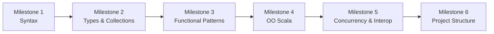

# Learning Path (Scala 3)

This roadmap is tailored for experienced C/C++/C# developers. It aims for fast, job‑ready fluency and doubles as a learner‑friendly narrative.

## Milestone 1: Core syntax and expressions
- val/var, blocks as expressions, top‑level definitions
- basic control flow: if, match, for‑comprehensions
- functions, multiple parameter lists, default/named args

## Milestone 2: Types and collections
- type inference, generics, variance
- enums, case classes, pattern matching
- standard collections: Seq, List, Vector, Map, Set

## Milestone 3: Functional patterns
- immutability by default, copy/update patterns
- Option/Either/Try, error handling
- higher‑order functions and function values

## Milestone 4: Object‑oriented Scala
- classes, traits, given/using (typeclass pattern)
- inheritance vs composition in Scala
- opaque types and extension methods

## Milestone 5: Concurrency and JVM interop
- Futures and basic concurrency patterns
- Java interop: collections, exceptions, nulls
- performance basics: boxing, allocation, value classes

## Milestone 6: Project structure
- sbt basics and common layout
- testing basics (e.g., ScalaTest or MUnit)

## Suggested progression (job starts next week)
1) Prioritize Milestones 1–3 this week, focusing on reading and understanding existing code.
2) Plan for up to ~2 hours per night; split time between reading and short exercises.
3) Do 3–5 exercises from `EXERCISES.md` per milestone, but bias toward code‑reading tasks.
4) Skim Milestones 4–5 to recognize patterns in the codebase (traits, givens, Future, interop).
5) Build a small project after Milestones 3 and 5 if time allows.

## Constraints
- No starter files; begin from scratch with small, self‑contained snippets.
- Prefer indentation‑style Scala in examples, unless a team style guide says otherwise.
- Be explicit about Scala 3 indentation markers (`then`/`do`) early to reduce syntax friction.
